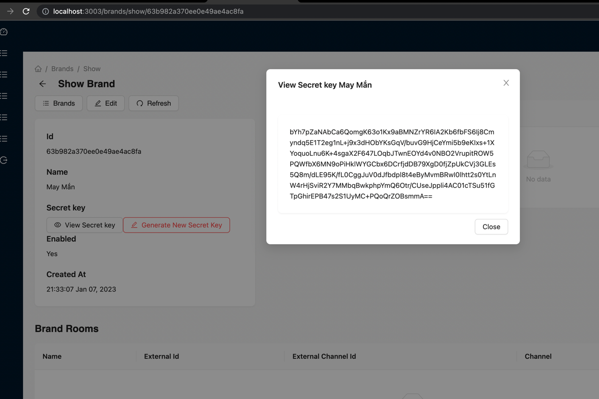

# React Chat app

## Tích hợp chat box vào Brand website

### Brand Secret key

- Đây là mã bí mật của brand để tạo request token. Chat box server sẽ dựa vào token này để xác thực chính xác 1 request đến từ brand

- Admin sẽ truy cập vào admin UI và cung cấp secret key cho brand https://{adminURL}/brands/show/63b982a370ee0e49ae4ac8fa


### Request token:
- Request token sẽ được sử dụng để xác thực request đến từ 1 brand
- Request token sẽ có hiệu lực trong vòng 5 giây kể từ thời điểm được tạo
- Là 1 chuỗi được tạo từ các thành phần sau:

  - `secretToken`: mã bí mật được admin cung cấp cho brand. Khi bị lộ mã này thì cần báo cho admin biết để được cấp mã mới.
  - `x-nonce`: là 1 chuỗi ngẫu nhiên brand cung cấp cho website thông qua request header `x-nonce`
  - `x-timestamp`: là giá trị timestamp thời điểm hiện tại. (UTC 0). Sẽ được gởi tới brand thông qua request header `x-timestamp`.
  - `x-brand-id`: là id của brand. Sẽ được admin cấp cho. Mã này là duy nhất và không bao giờ đổi được.
- Sample code để tạo request token
```javascript
import { randomStringGenerator } from '@nestjs/common/utils/random-string-generator.util';
import * as crypto from 'crypto';

const BRAND_AUTH_HASH_ALGORITHM = 'sha1';
const BRAND_AUTH_HASH_DIGEST = 'hex';

const generateToken = (brandId, secretKey, xNonce, xTimestamp) => {
  const headerMissingToken = {
    'x-nonce': xNonce,
    'x-timestamp': xTimestamp,
    'x-brand-id': brandId,
  };

  console.log('header missing token', headerMissingToken);
  console.log('secret key', secretKey);

  const sortedRequestProperties = Object.keys(headerMissingToken)
    .sort()
    .reduce((accumulator, key) => {
      accumulator[key] = headerMissingToken[key];
      return accumulator;
    }, {});

  console.log('sortedRequestProperties', sortedRequestProperties);
  const requestString = new URLSearchParams(
    sortedRequestProperties,
  ).toString();

  console.log('requestString', requestString);

  return crypto
    .createHmac(BRAND_AUTH_HASH_ALGORITHM, secretKey)
    .update(requestString)
    .digest(BRAND_AUTH_HASH_DIGEST);
  }

  // 63b109ab1d33d74995325a91
  const xBrandId = '63b982a370ee0e49ae4ac8fa';
  
  // xCmOGVhD1cb8F3exdj2lg75NaoNcgS0dzlN3lu0DnI6ChnDkMneBDvqdpbuaJIqua/S2ZU3IjKB3DLb0n9MzpEUNJjt42YwSPt9WOIJb5Cb+ibCzvANX5MSlCOhgWyXZCRwbohGDl+G9awKy7qERoTkOmGbY5+axlmIzbzCZ75vCszHmAsiqHo8A5c16LJLaC4OdIpZ/F/zTdFF9Xp3a6TMwlc9dIpJn0V02Jk2jN1g5/DhdFbU8QQ2D7oAoq4EZOSbKwzUJcrV9f//BcRolkdFfC1RMyz9Ph1GMRHtmM1f9hW+vhqGprs2Qndq6noQkxxZNg0sya1xCPXzw1kcngQ==
  const secretKey = process.env.brandSecretToken;// We should save the secret key in the server environment variable
  
  // 6bf647c4-f779-4ac8-a332-d0b56cee66a3
  const xNonce = randomStringGenerator();
  
  // 1675420858134
  const xTimeStamp = Date.now();// Please Make sure this will return the UTC 0 value
  
  const requestToken = generateToken(
    xBrandId,
    secretKey,
    xNonce,
    xTimeStamp
  );
  console.log('requestToken', requestToken);
```

- Sau đây là log khi chạy đoạn code trên với các giá trị tương ứng:

```composer log
header missing token {
  'x-nonce': '6bf647c4-f779-4ac8-a332-d0b56cee66a3',
  'x-timestamp': 1675420858134,
  'x-brand-id': '63b109ab1d33d74995325a91'
}
secretKey: xCmOGVhD1cb8F3exdj2lg75NaoNcgS0dzlN3lu0DnI6ChnDkMneBDvqdpbuaJIqua/S2ZU3IjKB3DLb0n9MzpEUNJjt42YwSPt9WOIJb5Cb+ibCzvANX5MSlCOhgWyXZCRwbohGDl+G9awKy7qERoTkOmGbY5+axlmIzbzCZ75vCszHmAsiqHo8A5c16LJLaC4OdIpZ/F/zTdFF9Xp3a6TMwlc9dIpJn0V02Jk2jN1g5/DhdFbU8QQ2D7oAoq4EZOSbKwzUJcrV9f//BcRolkdFfC1RMyz9Ph1GMRHtmM1f9hW+vhqGprs2Qndq6noQkxxZNg0sya1xCPXzw1kcngQ==
sortedRequestProperties {
  'x-brand-id': '63b109ab1d33d74995325a91',
  'x-nonce': '6bf647c4-f779-4ac8-a332-d0b56cee66a3',
  'x-timestamp': 1675420858134
}
requestString x-brand-id=63b109ab1d33d74995325a91&x-nonce=6bf647c4-f779-4ac8-a332-d0b56cee66a3&x-timestamp=1675420858134
requestToken 9c70078a4ffd9d2dc52d9cbd638f77bebd82ea8e
```
## Frontend App (client-folder)

Just install the dependencies and start the app:

```text
npm i

npm run start
```

## Backend (server folder)

If you have docker installed on your machine just
run the `docker-compose` file to set up the following images:

* Mongodb
* Redis


```text
docker-compose up -d 
```


Install the dependencies

```text
npm i
```

Run the server on development mode

```text
npm run start:dev
```