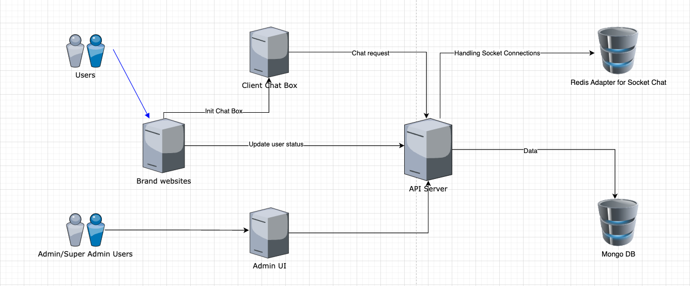

# Chat app

## System structure

### Workflows


- Client Chatbox: This is the service to provide the UI for the client. Framework: ReactJS
- API Server: Main APIs for the system. Framework: NestJS
- Admin UI: Admin interface to let the admin/subadmin manage the system. Framework: Refine.dev, ReactJS.
- Redis Adapter: Redis service for the socket connection
- Mongodb: Store the chat data.

### Technical requirements:
- NodeJS > 16
- MongoDB version > 4
- Redis
- ReactJS
- TypeScript
- NestJS
- Refine.dev

### Modules need to be installed on the server

- nvm
- nodejs > 16
- pm2
- nginx
- redis
- mongodb > 4

## Integrate the chat box into the brand websites

### Steps to do

- [Admin provides the secret key to the brand website](#brand-secret-key).
- [Brand websites uses the secret key to get the request token](#request-token).
- [Brand client (javascript) uses the access token to init the chat box](#nhúng-chat-box-vào-brand-website).
- [when the user status changed (balance, user name, banned status): call the API to the chatbox to update status](#sử-dụng-request-token-để-gởi-request-tới-api-chat-box)


### Brand Secret key

- This is the secret key of the brand to create the request token. The chat box server will use this one to authenticate the request
- Admin will access the admin UI to provide the secret key for the brand https://{adminURL}/brands/show/63b982a370ee0e49ae4ac8fa


### Request token
- Request token will be used to authenticate the brand request
- Request token will expire within 5 seconds since the creation time
- It's a string that is created from these parts:

  - `secretToken`: secret code that is provided by the admin.
  - `x-nonce`: a random string that the brand will provide to API via request header `x-nonce`
  - `x-timestamp`: The timestamp at the current moment via request header `x-timestamp`.
  - `x-brand-id`: Unique ID that provided by the admin
- Sample to create request token
```javascript
import { randomStringGenerator } from '@nestjs/common/utils/random-string-generator.util';
import * as crypto from 'crypto';

const BRAND_AUTH_HASH_ALGORITHM = 'sha1';
const BRAND_AUTH_HASH_DIGEST = 'hex';

const generateToken = (brandId, secretKey, xNonce, xTimestamp) => {
  const headerMissingToken = {
    'x-nonce': xNonce,
    'x-timestamp': xTimestamp,
    'x-brand-id': brandId,
  };

  console.log('header missing token', headerMissingToken);
  console.log('secret key', secretKey);

  const sortedRequestProperties = Object.keys(headerMissingToken)
    .sort()
    .reduce((accumulator, key) => {
      accumulator[key] = headerMissingToken[key];
      return accumulator;
    }, {});

  console.log('sortedRequestProperties', sortedRequestProperties);
  const requestString = new URLSearchParams(
    sortedRequestProperties,
  ).toString();

  console.log('requestString', requestString);

  return crypto
    .createHmac(BRAND_AUTH_HASH_ALGORITHM, secretKey)
    .update(requestString)
    .digest(BRAND_AUTH_HASH_DIGEST);
  }

  // 63b109ab1d33d74995325a91
  const xBrandId = '63b982a370ee0e49ae4ac8fa';
  
  // xCmOGVhD1cb8F3exdj2lg75NaoNcgS0dzlN3lu0DnI6ChnDkMneBDvqdpbuaJIqua/S2ZU3IjKB3DLb0n9MzpEUNJjt42YwSPt9WOIJb5Cb+ibCzvANX5MSlCOhgWyXZCRwbohGDl+G9awKy7qERoTkOmGbY5+axlmIzbzCZ75vCszHmAsiqHo8A5c16LJLaC4OdIpZ/F/zTdFF9Xp3a6TMwlc9dIpJn0V02Jk2jN1g5/DhdFbU8QQ2D7oAoq4EZOSbKwzUJcrV9f//BcRolkdFfC1RMyz9Ph1GMRHtmM1f9hW+vhqGprs2Qndq6noQkxxZNg0sya1xCPXzw1kcngQ==
  const secretKey = process.env.brandSecretToken;// We should save the secret key in the server environment variable
  
  // 6bf647c4-f779-4ac8-a332-d0b56cee66a3
  const xNonce = randomStringGenerator();
  
  // 1675420858134
  const xTimeStamp = Date.now();// Please Make sure this will return the UTC 0 value
  
  const requestToken = generateToken(
    xBrandId,
    secretKey,
    xNonce,
    xTimeStamp
  );
  console.log('requestToken', requestToken);
```

- The console log when you run the above source code:

```composer log
header missing token {
  'x-nonce': '6bf647c4-f779-4ac8-a332-d0b56cee66a3',
  'x-timestamp': 1675420858134,
  'x-brand-id': '63b109ab1d33d74995325a91'
}
secretKey: xCmOGVhD1cb8F3exdj2lg75NaoNcgS0dzlN3lu0DnI6ChnDkMneBDvqdpbuaJIqua/S2ZU3IjKB3DLb0n9MzpEUNJjt42YwSPt9WOIJb5Cb+ibCzvANX5MSlCOhgWyXZCRwbohGDl+G9awKy7qERoTkOmGbY5+axlmIzbzCZ75vCszHmAsiqHo8A5c16LJLaC4OdIpZ/F/zTdFF9Xp3a6TMwlc9dIpJn0V02Jk2jN1g5/DhdFbU8QQ2D7oAoq4EZOSbKwzUJcrV9f//BcRolkdFfC1RMyz9Ph1GMRHtmM1f9hW+vhqGprs2Qndq6noQkxxZNg0sya1xCPXzw1kcngQ==
sortedRequestProperties {
  'x-brand-id': '63b109ab1d33d74995325a91',
  'x-nonce': '6bf647c4-f779-4ac8-a332-d0b56cee66a3',
  'x-timestamp': 1675420858134
}
requestString x-brand-id=63b109ab1d33d74995325a91&x-nonce=6bf647c4-f779-4ac8-a332-d0b56cee66a3&x-timestamp=1675420858134
requestToken 9c70078a4ffd9d2dc52d9cbd638f77bebd82ea8e
```

### Integrate the chatbox into the website

- Add to the HTML <head>:
```html
<script src="http://localhost:3001/api/client-scripts/chat-box.js"></script>
```
- Embed this HTML code onto the place you want to display the chat box
```html
<div class="chatbox"
     data-brand-id="63b109ab1d33d74995325a91"
     data-chat-name="The way to the moon"
     data-channel-id="channel_the_way_to_the_moon"
     data-channel-name="The way to the moon"
     data-room-id="room_the_way_to_the_moon"
     data-room-name="The way to the moon"
     data-user-id="12345678"
     data-user-display-name="Harry Porter"
     data-timestamp="1675500677057"
     data-x-nonce="6ac8783d-b4e0-4247-8553-4e7982f8d28b"
     data-token="aa2c9df716f244bebcf91bedd3685a070c2f254f"
></div>
```
| Name                   | Required | Description                                                                                                                                                  |
|------------------------|----------|--------------------------------------------------------------------------------------------------------------------------------------------------------------|
| data-brand-id          | Yes      | ID Brand                                                                                                                                                 |
| data-chat-name         | Yes      | Name of chat box                                                                                                                                             |
| data-channel-id        | No       | ID channel. Each channel can have multiple rooms                                                                                                             |
| data-channel-name      | No       | Name of the channel                                                                                                                                              |
| data-room-id           | No       | ID Of the room                                                                                                                                                  |
| data-room-name         | No       | Name of the room                                                                                                                                                 |
| data-user-id           | Yes      | ID user                                                                                                                                                  |
| data-user-display-name | Yes      | the display name of the user of the chatbox. The system will use the first time as the display name. To update: you need to call the API |
| data-timestamp         | Yes      | Timestamp UTC. Timestamp at the current time. (UTC 0)                                                                                              |
| data-x-nonce           | Yes      | Random string                                                                                                                                        |
| data-token             | Yes      | Request token                                                                                                                                                |

- Bổ sung đoạn mã sau ở cuối body

```html

<script>
  var initChatboxes = function () {
    var chatBoxObject = new ChatBoxesManagement();
    chatBoxObject.initChatBoxFromSelector('.chatbox');
  }
  document.addEventListener("DOMContentLoaded", function () {
    initChatboxes();
  });
</script>
```

- `chatBoxObject.initChatBoxFromSelector('.chatbox')`: can use the HTMLID  or any parameter of the function `document.querySelectorAll`

### Use the request token to send the request to the API chat box

- You must attach this information into the header
  - `x-nonce`: a random string
  - `x-timestamp`: Timestamp at the current time. (UTC 0).
  - `x-brand-id`: Brand id
  - `x-token`: A Token was generated by the above information.
- Sample code to update
```javascript
    const xBrandId = this.configService.get('brandId');
    const secretKey = this.configService.get('chatBoxSecretKey');
    const xNonce = randomStringGenerator();
    const xTimeStamp = Date.now();
    const requestToken = this.generateToken(
      xBrandId,
      secretKey,
      xNonce,
      xTimeStamp,
    );

    return axios
      .patch(
        this.configService.get('chatBoxApiBaseUrl') + 'brand-chat/user/' + id,
        {
          displayName: displayName,
          enabled: status,
        },
        {
          headers: {
            'x-brand-id': xBrandId,
            'x-timestamp': xTimeStamp,
            'x-nonce': xNonce,
            'x-token': requestToken,
            'Content-Type': 'application/json',
          },
        },
      )
      .then((response) => {
        if (response.status !== 200) {
          return res.send(JSON.stringify(response));
        }
        return res.redirect('/simple-chat-box');
      })
      .catch((error) => {
        return res.send(error.toJSON());
      });
```

### Sample code

See the sample code at [Multiple chatbox at on 1 page](example/src/app.controller.ts) Or [Update the username on the chat box](example/src/simple-chat-box.controller.ts)

## Frontend App (client-folder)

Just install the dependencies and start the app:

```text
npm i

npm run start
```

## Backend (server folder)

If you have docker installed on your machine just
run the `docker-compose` file to set up the following images:

* Mongodb
* Redis


```text
docker-compose up -d 
```


Install the dependencies

```text
npm i
```

Run the server on development mode

```text
npm run start:dev
```
